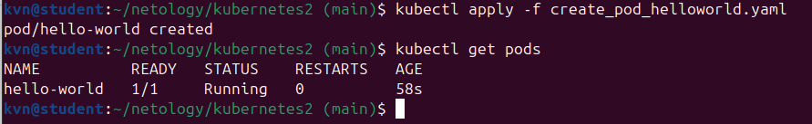
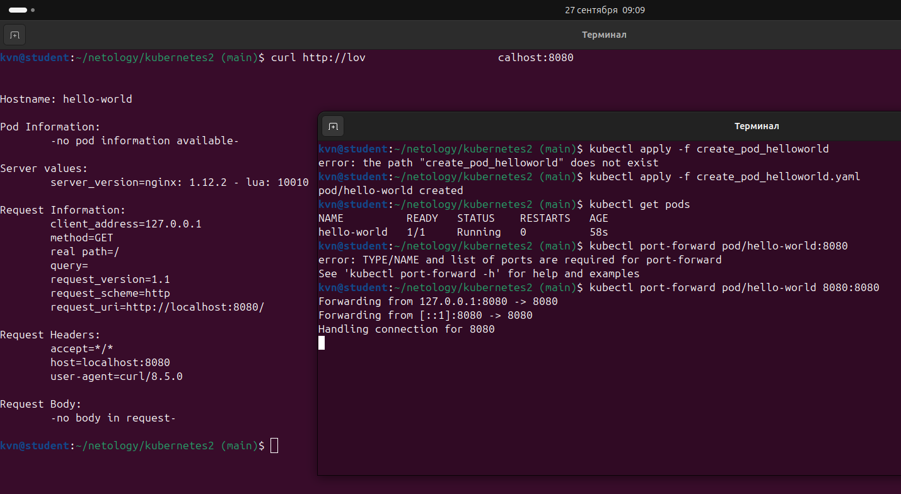

# Домашнее задание: Pod и Service в Kubernetes

Развёртывание Pod с приложением в Kubernetes и подключение к нему с локального компьютера через `kubectl port-forward`.

## Состав репозитория

| Файл | Ресурс |
|---|---|
| `create_pod_helloworld.yaml` | Pod `hello-world` — Задание 1 |
| `create_pod_netologyweb.yaml` | Pod `netology-web` — Задание 2 |
| `create_service_netologysvc.yaml` | Service `netology-svc` — Задание 2 |

## Задание 1. Pod `hello-world`

Манифест:  
  [create_pod_helloworld.yaml](create_pod_helloworld.yaml)  

- образ `gcr.io/kubernetes-e2e-test-images/echoserver:2.2`;
- приложение внутри контейнера слушает порт `8080`.

Создание Pod и проверка состояния:

```bash
kubectl apply -f create_pod_helloworld.yaml
kubectl get pods
```



Подключение к Pod с локального компьютера:

```bash
kubectl port-forward pod/hello-world 8080:8080
curl http://localhost:8080
```



## Задание 2. Pod `netology-web` и Service `netology-svc`

Манифесты: 
  [create_pod_netologyweb.yaml](create_pod_netologyweb.yaml)  
  [create_service_netologysvc.yaml](create_service_netologysvc.yaml)  

- Pod `netology-web` имеет метку `app: netology-web` и использует тот же образ `echoserver:2.2`;
- Service `netology-svc` выбирает Pod по метке `app: netology-web`, публикует порт `80` и пересылает трафик на `targetPort: 8080`.

Создание Pod и Service, проверка состояния:

```bash
kubectl apply -f create_pod_netologyweb.yaml
kubectl apply -f create_service_netologysvc.yaml
kubectl get pods
kubectl get svc
kubectl get endpoints netology-svc
```

`kubectl get endpoints netology-svc` должен показать адрес только Pod `netology-web`.


Подключение к Service со своего локального компьютера:

```bash
kubectl port-forward service/netology-svc 8081:80
curl http://localhost:8081
```


## Использованные команды

| Команда | Назначение |
|---|---|
| `kubectl apply -f <манифест>` | создание ресурса из манифеста |
| `kubectl get pods` | список Pod и их состояние |
| `kubectl get svc` | список Service |
| `kubectl get endpoints <service>` | Pod, к которым привязан Service |
| `kubectl port-forward pod/<pod> <локальный>:<порт>` | проброс порта Pod на локальную машину |
| `kubectl port-forward service/<svc> <локальный>:<порт>` | проброс порта Service на локальную машину |
| `curl http://localhost:<порт>` | проверка ответа приложения |
